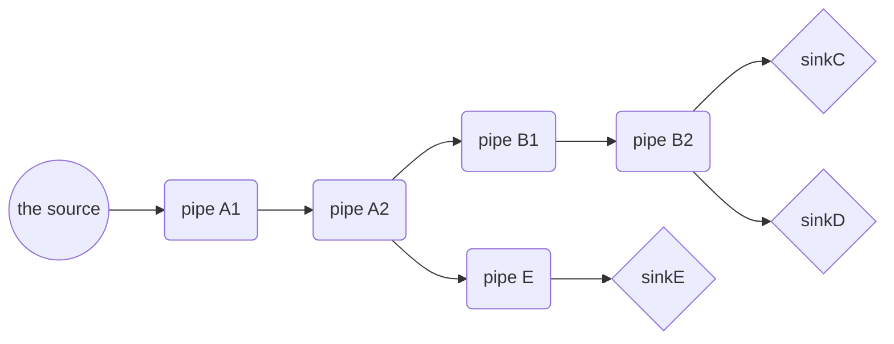

# Chapter 1

Dataflow es la hostia.

```mermaid
graph LR
  source((the source)) --> pipeA1(pipe A1)
  pipeA1               --> pipeA2(pipe A2)
  pipeA2               --> pipeB1(pipe B1)
  pipeA2               --> pipeE(pipe E)
  pipeB1               --> pipeB2(pipe B2)
  pipeE                --> sinkE{sinkE}
  pipeB2               --> sinkC{sinkC}
  pipeB2               --> sinkD{sinkD}
```
